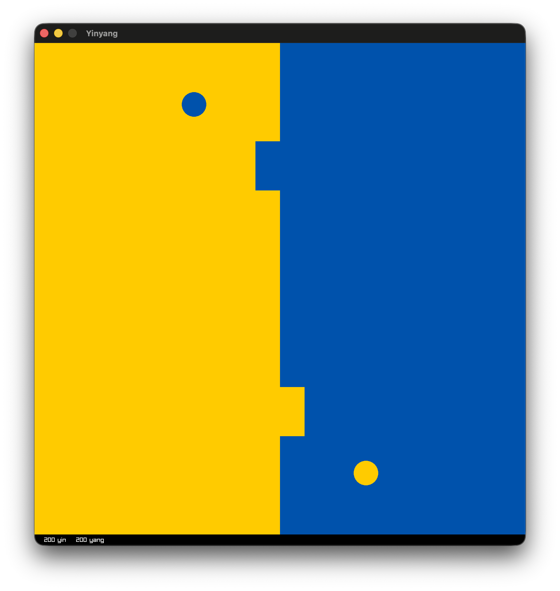
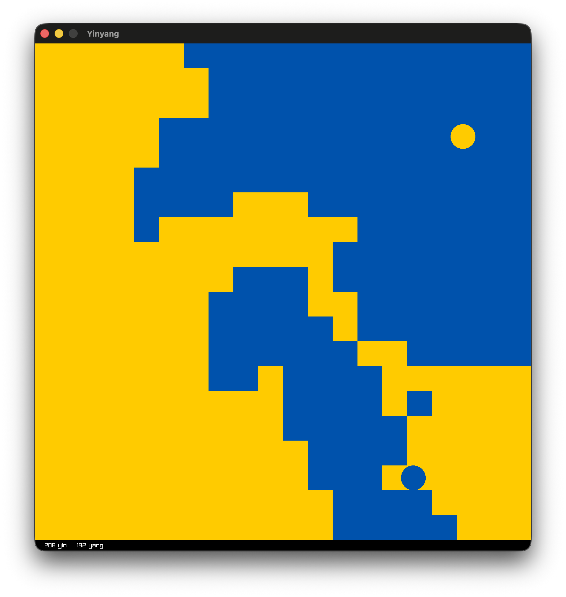

# Yinyang

I saw this on X, and had to try it for myself.




# Build

No binaries. You will need to build Yinyang from source if you want to try it.

1. [Install Odin](https://odin-lang.org/docs/install/) if you haven't done so already

2. Clone this repository
```console
git clone https://github.com/chris-braun/yinyang.git
```

3. Run it with Odin
```console
cd yinyang
odin run .
```
